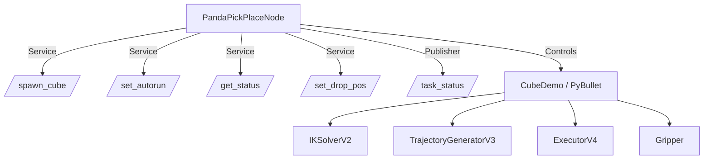

 # Panda Pick-and-Place Simulation (ROS2 + PyBullet)

This project demonstrates a **ROS2-based robotic pick-and-place system** using the Franka Panda arm in PyBullet.  
It was built step by step to learn and showcase **ROS2 nodes, services, publishers, and modular robotics control**.
<p align="center">
  
  <br/>
  <em>Demo (2× speed)</em>
</p>
---

## 🎯 Motivation
The goal of this project is to **practice real-world robotics software engineering**:
- Learn how ROS2 nodes, services, and publishers work.
- Integrate modular components (IK solver, trajectory generator, executor, gripper).
- Build a task queue system (home → pick → place → home).
- Provide both CLI and GUI interfaces for interaction.

This is not just a demo, but a **learning platform** to explore how industrial robotic software is structured.


## 🏗 Architecture



- **Node**: `panda_pickplace_node`
- **Services**: `/spawn_cube`, `/set_autorun`, `/get_status`, `/set_drop_pos`
- **Publisher**: `/task_status` (TaskStatus msg)
- **Simulation**: PyBullet Panda arm with tray and cubes

---

## ✅ Features

- ROS2 Node (`panda_pickplace_node`)
- Services:
  - `/spawn_cube (SpawnCube)`
  - `/set_autorun (SetAutorun)`
  - `/get_status (GetStatus)`
  - `/set_drop_pos (SetDropPos)`
- Topic publisher:
  - `/task_status (TaskStatus)`
- Task queue logic (home → pick → place → home)
- PyBullet simulation (Panda arm, tray, cubes)
- Modular components:
  - `IKSolverV2`
  - `TrajectoryGeneratorV3`
  - `ExecutorV4`
  -  `Gripper (supports **physics-based grasping** instead of teleport-only attach)` 

- Optional GUI (PyQt5) for interactive control and real-time task status

---

## 🚀 Usage

### Build
```bash
colcon build --packages-select my_panda_interfaces my_panda_sim
source install/setup.bash
```

### Run main node
```bash
ros2 launch my_panda_sim run.launch.py
```

### Interact via CLI
```bash
# Spawn a cube
ros2 service call /spawn_cube my_panda_interfaces/srv/SpawnCube "{}"

# Pause autorun
ros2 service call /set_autorun my_panda_interfaces/srv/SetAutorun "{enable: false}"

# Query status
ros2 service call /get_status my_panda_interfaces/srv/GetStatus "{}"

# Change tray position
ros2 service call /set_drop_pos my_panda_interfaces/srv/SetDropPos "{x: 0.0, y: 0.55, z: 0.15}"

# Resume autorun
ros2 service call /set_autorun my_panda_interfaces/srv/SetAutorun "{enable: true}"
```

### Run optional GUI
```bash
ros2 run my_panda_sim gui_control
```

---

## 📸 Demo

- PyBullet simulation with Panda robot picking and placing cubes.
- GUI with real-time task status updates.

*(Add screenshots here)*

---

## 📂 Project Structure

```
📦 my_panda_sim
├── my_panda_sim/
│   ├── run_node.py          # Main ROS2 node
│   ├── cube_demo.py         # Task queue + PyBullet integration
│   ├── trajectory_generator_v3.py
│   ├── ik_solver_v2.py
│   ├── executor_v4.py
│   ├── gripper.py
│   └── gui_control.py       # PyQt5 GUI client
├── my_panda_interfaces/
│   ├── srv/
│   │   ├── SpawnCube.srv
│   │   ├── SetAutorun.srv
│   │   ├── GetStatus.srv
│   │   └── SetDropPos.srv
│   └── msg/TaskStatus.msg
├── launch/run.launch.py
├── setup.py
├── CMakeLists.txt
└── package.xml
```

---

## 📈 Engineering Practices

- **Modular design** → IK, trajectory, executor, and gripper are separated.
- **Custom ROS2 interfaces** → srv/msg instead of hard-coded APIs.
- **Real-time monitoring** → `/task_status` publisher for GUI and CLI.
- **Extendable** → currently single node, but ready for multi-node split (`ik_node`, `traj_node`, `exec_node`).
- **Physics realism** → gripper motion uses PyBullet’s position-control motors, so objects are clamped and lifted by actual contact forces (not just constraints).
- **Industry-style workflow** → build with colcon, launch with ROS2, simulation in PyBullet.

---

## 🔮 Next Steps

- [ ] Split into multiple nodes (`ik_node`, `traj_node`, `exec_node`)
- [ ] Replace IK with TRAC-IK
- [ ] Add collision checking
- [ ] Connect to Gazebo / MoveIt2
- [ ] Improve GUI with interactive 3D view

---

## 📝 Summary

This project demonstrates a **working ROS2 robotic application** with:
- Node
- Services
- Publisher
- Custom interfaces
- Simulation integration
- Modular robotic control

It shows both **practical ROS2 development** and **engineering design thinking**, making it a strong foundation for further research or industrial integration.
